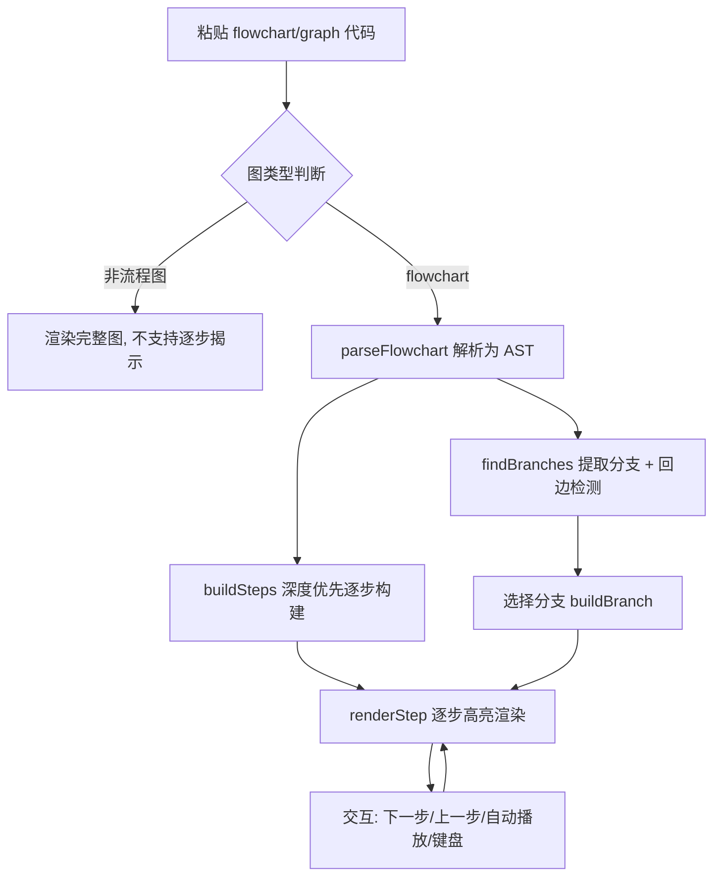
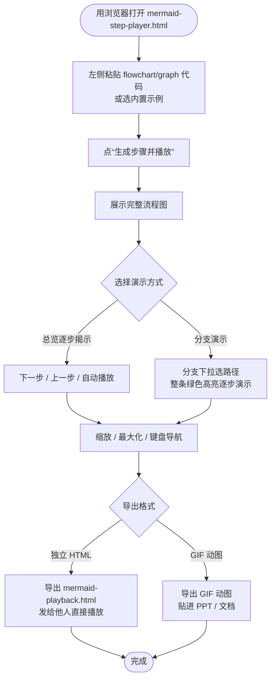

# Mermaid 流程图 · 深度优先逐步播放器

一个纯前端、零构建的单文件工具：把任意 `flowchart` / `graph` 代码，按**深度优先**顺序逐步揭示节点与边，并可按**分支**（源→汇的简单路径）逐条演示。解析交给开源库 [`mermaid-ast`](https://www.npmjs.com/package/mermaid-ast)（基于 Mermaid 官方 JISON 语法），渲染交给 `mermaid@10`。

## 软件截图


## 功能特性

- **逐步揭示**：按深度优先顺序逐节点/边高亮，绿色=当前分支路径，橙色脉冲=当前节点。
- **分支演示**：右侧“分支”下拉框选择某条分支（源→汇的简单路径），整条分支绿色高亮并逐步演示；逐步播放与总览模式一致的“节点弹出 + 连线淡入”过渡效果。
- **环安全**：遇到回边/环（`A → … → A`）不沿其无限遍历，而是检测出来并用**橙色虚线**标为“循环边”，并在总览提示。
- **名称去重**：多分支同名时自动追加 ` #2` `#3`，保证下拉框每项唯一可选。
- **缩放 / 最大化**：滑条、输入框、滚轮三种缩放方式；一键铺满画板。
- **键盘导航**：`←` 上一步、`→` 下一步、`空格` 播放/暂停、`Esc` 退出最大化 / 关闭指引。
- **操作指引**：内置“操作指引”弹窗，说明全部交互与配色含义。
- **导出播放文件**：点“⤓ 导出播放文件”并选格式，可生成两类产物：
  - **独立 HTML 播放文件**：只含右侧播放界面、已内嵌当前图的 `mermaid-playback.html`，可直接发给他人播放；打开即自动生成当前图，左侧输入被隐藏。
  - **GIF 动图**：把逐步揭示的每一步渲染成帧、编码为动画 GIF，可直接贴进 PPT / 文档。GIF 按**完整流程图布局**渲染（各帧尺寸/位置一致、文字大小恒定，未揭示的「是/否」等分支标签不会提前出现），导出尺寸 = 完整图真实尺寸 ×「导出缩放」（默认 2×，可调）。

## 工作流程



## 用法

直接用浏览器打开 `mermaid-step-player.html` 即可（需联网加载 CDN 资源）：

1. 左侧粘贴完整 `flowchart` / `graph` 代码，或选内置示例；
2. 点“生成步骤并播放”，先展示完整流程图；
3. 用“下一步/上一步/自动播放”逐步揭示，或在“分支”下拉框选某条分支演示；
4. 非流程图（时序图、类图等）直接显示完整图，不支持逐步揭示；
5. 点“⤓ 导出播放文件”，先在「格式」下拉选 **独立 HTML 播放文件** 或 **GIF 动图**；导出 GIF 时可用「导出缩放」调节输出尺寸（默认 2×），然后导出：HTML 产物为独立的 `mermaid-playback.html`（已内嵌当前图、无左侧输入），GIF 产物为动画 `mermaid-playback.gif`。


## 使用说明（流程图）



##  导出gif效果


## 测试

分支提取算法（`findBranches`）有配套自测，覆盖：无标签易重名图、带标签复杂图、三路并行、含回边环图、平行同标签去重、多源+合并+回边大图。

```bash
node branch_test.mjs      # 退出码 0=全部通过，1=有失败
```

测试同时是 `findBranches` 的镜像实现（含环检测 `backEdges`、名称去重），改动 HTML 前先跑测试确认不回归。

## 目录结构

```
mermaid-step-player/
├── mermaid-step-player.html   # 单文件播放器（全部逻辑）
├── branch_test.mjs            # 分支算法自测（node 运行）
├── push.bat                   # 一键同时推送 gitee + github
├── README.md
└── diagram/
    └── 总体设计架构.md          # 架构与算法说明（含 mermaid 图）
```

## 已知边界

- 解析/渲染依赖 `esm.sh` 与 `cdn.jsdelivr.net`，需联网。
- 子图（`subgraph`）容器按节点处理，内部边参与 DFS 揭示。
- 超大图因每步全量重渲染可能偏慢（后续优化方向）。
