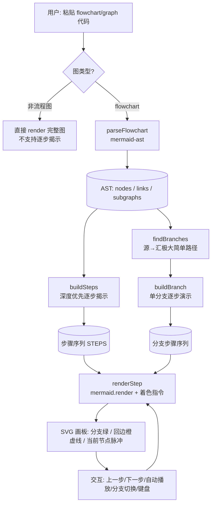
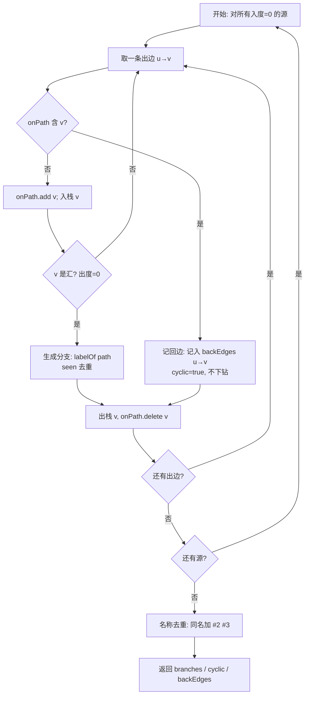
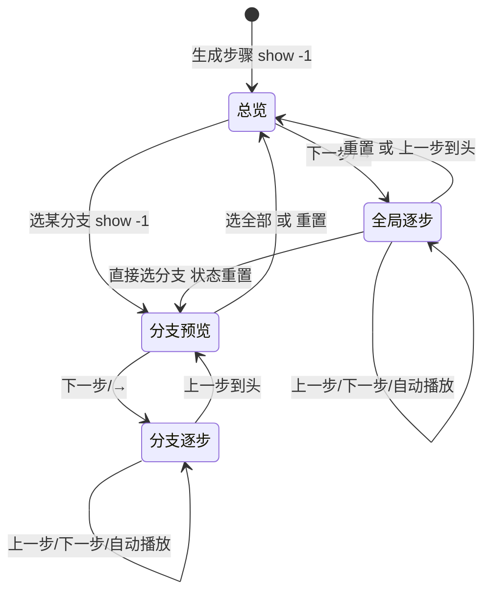
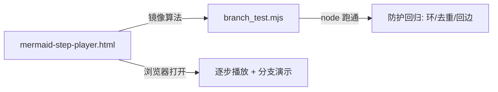

# 总体设计架构

本文档说明 Mermaid 流程图逐步播放器的整体架构、核心算法与交互模型。所有图示均为 Mermaid，可直接在本播放器中渲染查看。

## 1. 整体架构

用户输入的流程图代码，经解析得到 AST，再拆解为“分支”与“步骤”，最终在每次渲染时通过 Mermaid class / 边 class 做高亮着色。

## 2. 核心：分支提取算法 `findBranches`

**定义**：分支 = 图中所有“极大简单路径（源→汇）”。每条路径的诱导子图天然是单条简单路径：恰好 1 个头节点（入度 0）、1 个叶子节点（出度 0），其余均为中间节点。

**关键难点**：流程图可能含回边（环）。若不加保护，DFS 会沿 `A → … → A` 无限递归。算法用 **on-path 集合**在 DFS 下钻前判断目标是否已在当前路径上：

- 是 → 记为本回边（加入 `backEdges`），标记 `cyclic=true`，**不再下钻**（防死循环）；
- 否 → 正常递归。

分支名由路径上各边标签拼接而成；无标签时回退到目标节点 id；同名分支自动追加 ` #2` `#3` 去重。

## 3. 播放与模式切换（状态模型）

`show(i)` 以 `i===-1` 表示“总览/分支预览”，`i>=0` 表示逐步演示中的第 `i` 步。`branchMode` 与 `branchPreview` 控制是否处于单分支演示。

> 注意：点击“生成步骤”会重置 `branchMode` / `branchPreview`，避免上一图的分支预览残留导致画板不刷新。

## 4. 着色与样式

渲染时对 SVG 施加三类 class，互不冲突：

| 样式 | 含义 | 触发 |
|------|------|------|
| `.branchNode` / `.branch-edge` + `.edge-flow` | 当前分支路径（绿 + 流动虚线） | 在 `branchNodes` / `branchEdges` 中 |
| `.cycle-edge` | 回边 / 循环（橙色虚线） | 在 `backEdges` 且两端均已揭示 |
| `.dimNode` / `.dim-edge` | 其它已揭示节点/边（淡灰） | 已揭示但不在当前分支 |
| `.curNode` | 当前节点（橙色脉冲光晕） | `currentId`（预览态不加） |

回边**只做视觉标记、绝不沿其遍历**，因此既能提示“否会回流”，又不会触发无限循环。

## 5. 模块依赖与测试

- 解析：`mermaid-ast`（`parseFlowchart` / `renderFlowchart` / `detectDiagramType` / `parse` / `render`）。
- 渲染：`mermaid@10` 的 `mermaid.render`。
- 算法自测：`branch_test.mjs`（Node 运行），覆盖无标签易重名、带标签复杂图、三路并行、含回边环、平行同标签去重、多源+合并+回边大图，并断言分支数、1 头 1 叶、名称唯一、回边检测。

