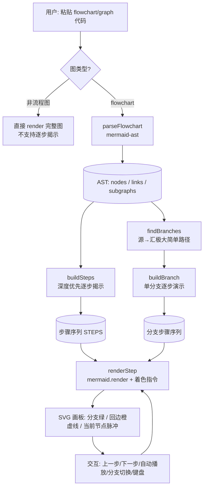
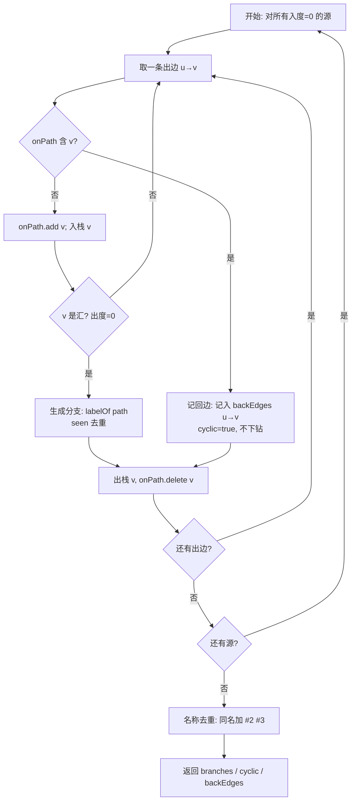
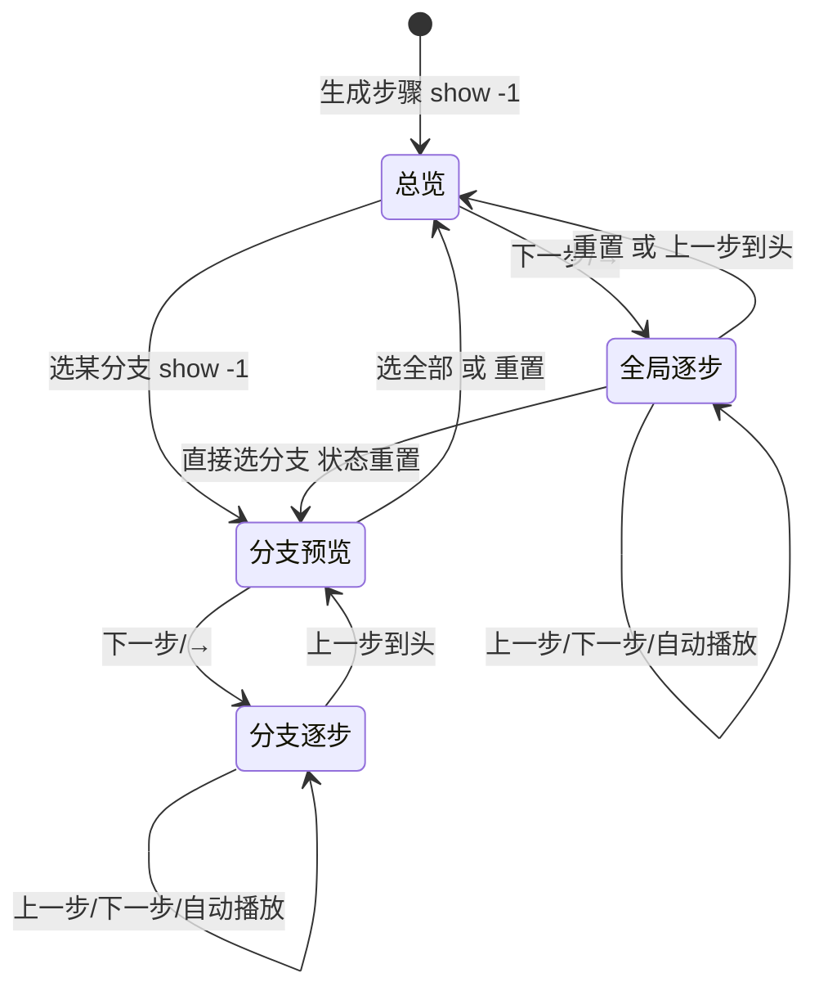
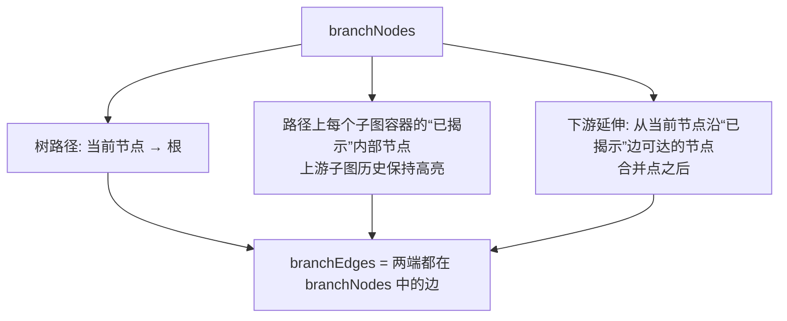
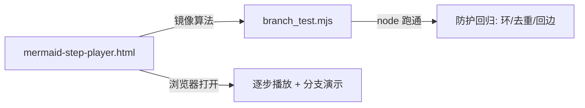
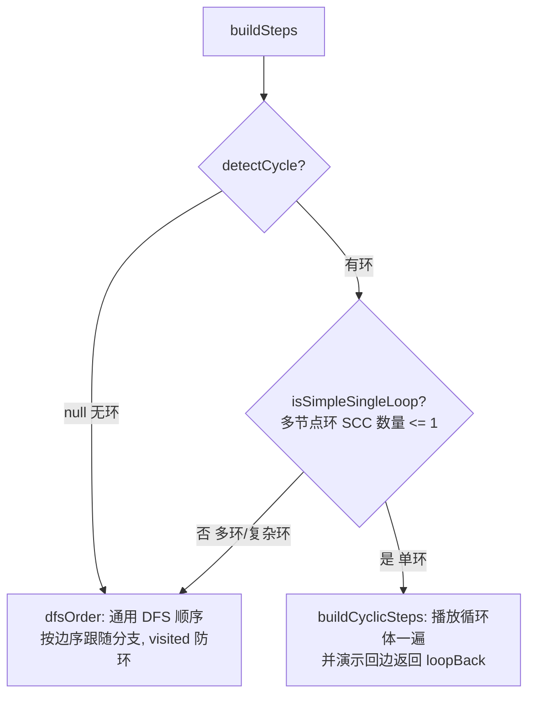

# 总体设计架构

本文档说明 Mermaid 流程图逐步播放器的整体架构、核心算法与交互模型。所有图示均为 Mermaid，可直接在本播放器中渲染查看。

## 1. 整体架构

用户输入的流程图代码，经解析得到 AST，再拆解为“分支”与“步骤”，最终在每次渲染时通过 Mermaid class / 边 class 做高亮着色。



## 2. 核心：分支提取算法 `findBranches`

**定义**：分支 = 图中所有“极大简单路径（源→汇）”。每条路径的诱导子图天然是单条简单路径：恰好 1 个头节点（入度 0）、1 个叶子节点（出度 0），其余均为中间节点。

**关键难点**：流程图可能含回边（环）。若不加保护，DFS 会沿 `A → … → A` 无限递归。算法用 **on-path 集合**在 DFS 下钻前判断目标是否已在当前路径上：

- 是 → 记为本回边（加入 `backEdges`），标记 `cyclic=true`，**不再下钻**（防死循环）；
- 否 → 正常递归。

分支名由路径上各边标签拼接而成；无标签时回退到目标节点 id；同名分支自动追加 ` #2` `#3` 去重。



## 3. 播放与模式切换（状态模型）

`show(i)` 以 `i===-1` 表示“总览/分支预览”，`i>=0` 表示逐步演示中的第 `i` 步。`branchMode` 与 `branchPreview` 控制是否处于单分支演示。



> 注意：点击“生成步骤”会重置 `branchMode` / `branchPreview`，避免上一图的分支预览残留导致画板不刷新。

## 4. 着色与样式

渲染时对 SVG 施加三类 class，互不冲突：

| 样式 | 含义 | 触发 |
|------|------|------|
| `.branchNode` / `.branch-edge` + `.edge-flow` | 当前分支路径（绿 + 流动虚线） | 在 `branchNodes` / `branchEdges` 中 |
| `.cycle-edge` | 回边 / 循环（橙色虚线） | 在 `backEdges` 且两端均已揭示 |
| `.dimNode` / `.dim-edge` | 其它已揭示节点/边（淡灰） | 已揭示但不在当前分支 |
| `.curNode` | 当前节点（橙色脉冲光晕） | `currentId`（预览态不加） |

回边**只做视觉标记、绝不沿其遍历**，因此既能提示“否会回流”，又不会触发无限循环。

### 4.1 「全部（深度优先）」模式的 `branchNodes` 构成

该模式与「独立分支」一致，**始终渲染完整图**，仅用 class 高亮。某一步的绿色集合 `branchNodes` 由三部分并成：



- 用「路径 + 路径上子图已揭示内部节点」而非「累计已揭示集合」：避免并行分支同时变绿（未按分支高亮）。
- 用「路径上子图容器已揭示内部节点」而非「纯 DFS 路径」：避免跳到下一子图时，上游子图兄弟节点（如 `A1,A2`）丢失高亮。
- 取「已揭示」而非「全部」内部节点：保留增量揭示，且未走完的当前子图整体视作当前分支（可接受）。

> 独立分支模式（`buildBranch`）仍用「单路径切片」语义，不受影响。

### 4.2 子图顺序与选根的两个坑

- **子图入口顺序**：解析器给的 `sg.nodes` 顺序可能被打乱（实测 `["B","A","C","B"]`），故子图入口按「内部入度 0」推导（拓扑序），不依赖 `sg.nodes`。
- **选根**：解析器把子图内部节点排在容器之前，若直接取第一个入度 0 节点会误选内部节点、导致容器不被进入、`parent` 链断裂。选根时跳过子图内部节点。

详见 [`../lesson/子图顺序与分支高亮踩坑记录.md`](../lesson/子图顺序与分支高亮踩坑记录.md)。

## 5. 模块依赖与测试

- 解析：`mermaid-ast`（`parseFlowchart` / `renderFlowchart` / `detectDiagramType` / `parse` / `render`）。
- 渲染：`mermaid@10` 的 `mermaid.render`。
- 算法自测：`branch_test.mjs`（Node 运行），覆盖无标签易重名、带标签复杂图、三路并行、含回边环、平行同标签去重、多源+合并+回边大图，并断言分支数、1 头 1 叶、名称唯一、回边检测。
- 导出播放文件：`exportPlayback()` 克隆右侧播放界面 + 内嵌当前 mermaid 源码，生成无左侧输入、打开即自动 `generate()` 的独立 HTML（`mermaid-playback.html`）；导出的脚本通过锚定脚本末尾的正则把“载入默认示例”替换为“自动生成当前图”，并保留全部交互按钮与操作指引弹窗。导出文件仍依赖 CDN 渲染库。



## 6. 含环图：循环演示模式与多环降级

`buildSteps` 先调用 `detectCycle` 判断图是否含环，再决定走哪条播放路径：



- **`buildCyclicSteps` 只为「单一简单环」设计**：它把「是否环内节点」作为重建遍历的依据、只在「终止路径」走非环后继，并插入回边返回动画。对单环图（含环上分支，如示例一）表现正确。
- **多环 / 环上带复杂分支的图**不能塞进单环模型：决策节点若同时是环内节点，其分支（也是环内节点）会在终止遍历里被 `if(isCycle(v)) continue` 跳过，导致「不沿分支走、直接跳到相邻节点」。故用 `isSimpleSingleLoop` 门控，这类图**回退到 `dfsOrder`**——每个节点只访问一次、回边不再下钻，分支仍按边序正确跟随。
- `loopDemo` 标志记录「是否真正进入了循环演示模式」，供状态文案如实区分「单环演示回边返回」与「多环回退 DFS」，避免提示与真实行为不一致。

### 6.1 回边（循环边）的「执行」反馈

回边默认以静态橙色虚线（`cycle-edge`）标出；当它「被走过」时，再叠加更亮更粗的橙 + 流动虚线（`cycle-edge-active`）。关键约束：**反馈只绑定「这一步真正走过的那一条回边」，而不是「与当前节点有关的全部回边」**，且**动效仅持续几秒**。

```mermaid
flowchart TD
    EB[判定“正在执行的回边” execBack] --> LB{本步是 loopBack?}
    LB -->|是| T1[指向当前节点(回到起点)的回边]
    LB -->|否| PREV{prev→current 是真实前向边?}
    PREV -->|是 普通前向边| NONE[不点亮回边]
    PREV -->|否 循环体尾部回退离开循环| T2[prev 指回循环内的回边]
    T1 --> ACT[仅该 1 条回边点亮 cycle-edge-active]
    T2 --> ACT
    ACT --> TO[setTimeout ~2.6s 后移除类]
    ACT --> NEXT[点“下一步”整图重渲染→立即消失]
```

- **为何不能「节点碰到的回边都点亮」**：若按「当前节点是回边任一端」就点亮，循环头/尾每步都会亮，时机混乱，且与「当前正在执行的那条边」无关。必须绑定具体的「执行边」。
- **多环 DFS 回退时**：回边从不在连续两步间被「正向遍历」，但当从循环体尾部回退离开循环（`prev→current` 不是真实前向边）时，`prev` 指回循环内的那条回边即视为「沿回边返回」所走过的边，故在离开循环的这一步点亮它（如 `H2→H`、`R2→R`、`W2→W`）。
- **动效是短暂的**：`setTimeout` 约 2.6s 后移除 `cycle-edge-active`；离开当前节点（点下一步重渲染整图）立即消失，不长期占用视觉。

详见 [`../lesson/回边执行反馈应绑定具体执行边而非节点踩坑记录.md`](../lesson/回边执行反馈应绑定具体执行边而非节点踩坑记录.md)。

详见 [`../lesson/含环多循环图播放顺序错乱踩坑记录.md`](../lesson/含环多循环图播放顺序错乱踩坑记录.md)。
