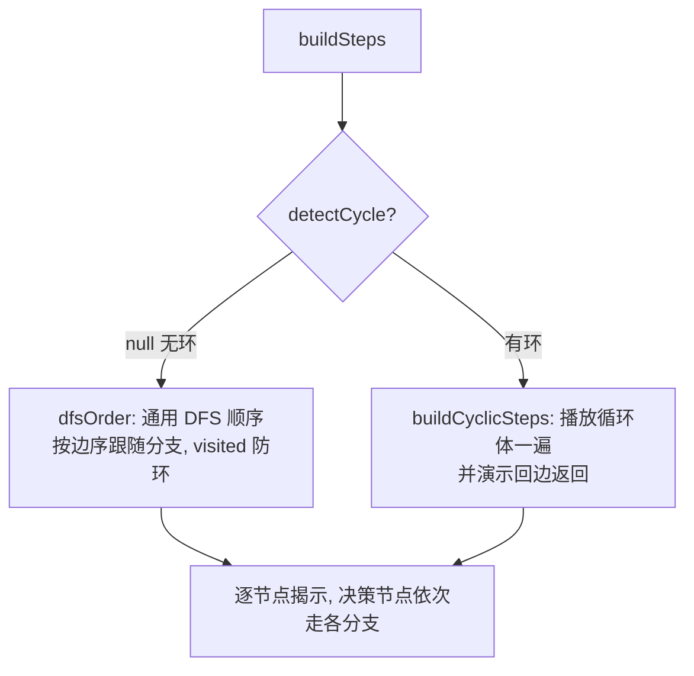
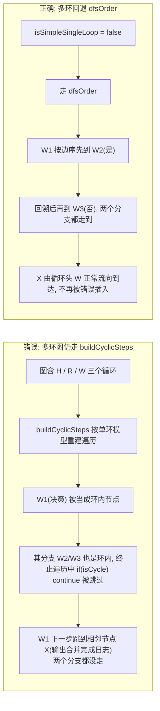
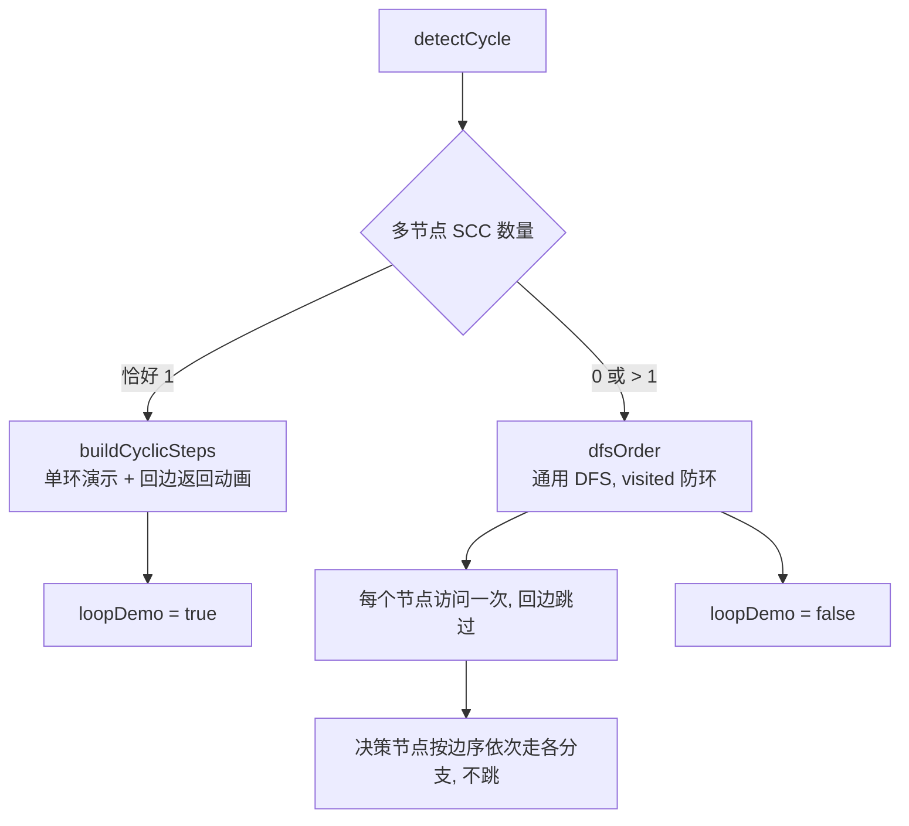

# 含环多循环图：全局模式分支错乱 踩坑记录

本文记录 `mermaid-step-player` 在「全局（深度优先）」模式下，遇到**含多个循环、且分支挂在循环上**的流程图时，决策节点不沿分支前进、反而跳到相邻节点的 bug，以及最终采用的修正方案。所有图示均为 Mermaid，可直接在本播放器中渲染。

---

## 背景：全局模式的两条播放路径

`buildSteps` 先调用 `detectCycle(ast)` 判断图是否含环，再决定走哪条路：

- **无环** → `dfsOrder`：标准 DFS，按边在 mermaid 文本里的出现顺序跟随后继，决策节点会先走完一条分支、回溯后再走另一条。**分支跟随正确。**
- **有环** → 此前**无条件**进入 `buildCyclicSteps`：一个为「单一简单环」量身定制的「循环演示」模式，会播放循环体一遍并演示回边返回。



问题就出在「有环就进 `buildCyclicSteps`」这一步——它把「是否含环」当成了「可用单环模型」的充分条件。

---

## 坑：多环图里决策节点不跟分支、跳到相邻节点

测试图（multiReportPlot 合并流程）含有**三个独立循环**：`H`（生成各报告）、`R`（生成封面与目录）、`W`（逐个文件合并）。在 `W` 循环内有一个决策节点 `W1`（文件路径为空），其出边为 `是 → W2`、`否 → W3`。

`buildCyclicSteps` 为「单一简单环」设计：它把「是否环内节点（`isCycle`）」作为重建遍历的依据，并且其「终止路径」遍历中写死了 `if(isCycle(v)) continue`——只走**非环**后继。当图里有多个循环、且分支又挂在循环上时：

1. `W1` 被归为环内节点；
2. 它的两条分支 `W2`/`W3` **同样也是环内节点**；
3. 于是 `W1` 的两条分支在「终止路径」遍历里全部被跳过；
4. 播放器没有沿任一分支前进，而是顺着循环头 `W` 的其它流向，直接跳到了相邻节点 `X`（输出合并完成日志）。



> 注意：`buildCyclicSteps` 的「回边返回」动画只服务于「演示一次循环」这一特殊诉求，**不是遍历正确性的保证**。一旦图结构超出「单环」假设，它就不再产生正确的后继序列。

---

## 修正

新增 `isSimpleSingleLoop(cyc)`：图中「多节点 SCC（强连通分量）」数量 ≤ 1 才视为「单环」。`buildSteps` 仅在单环时进入 `buildCyclicSteps`，否则回退 `dfsOrder`。

`dfsOrder` 本身用 `visited` 集合防环（回边不再下钻），因此即使图含环也不会无限递归，且**分支仍按边序正确跟随**。另增 `loopDemo` 标志，让状态文案如实区分「单环演示回边返回」与「多环回退 DFS」，避免提示与真实行为不一致。



调用点（`generate` 内）：

```js
const cyc = detectCycle(ast);
loopDemo = !!cyc && isSimpleSingleLoop(cyc);   // 仅单环进入循环演示；多环回退 DFS
```

---

## 经验

- **特例处理器绝不能对「所有触发表面条件的输入」偷偷接管**：要用「能力探测」来门控。`buildCyclicSteps` 仅凭「图里存在回边」就被启用，结果把另一种形状（多环 + 环上分支）的遍历结果搞错。开关必须由「该处理器能否正确处理此形状」决定，而非「是否命中某个表面特征」。
- **循环处理要考虑「多循环 + 环上分支」，不能只假设一个理想单环**。`detectCycle` 能发现环，但「有环」≠「可用单环模型」。
- **「逐步播放」这类遍历正确性，优先用通用算法（带 `visited` 的 DFS）做默认路径**；把「演示性」增强（如回边返回动画）只叠加在「已证明适用」的形状上。默认正确，特例锦上添花。
- **判定「是否进入特殊模式」的开关，要和数据一起用于 UI 文案**：新增 `loopDemo` 标志，使状态提示与真实行为一致，避免「提示要演示回边、实际却回退 DFS」的误导。

---

## 小结（落地 Checklist）

- [x] `isSimpleSingleLoop(cyc)`：多节点 SCC 数 ≤ 1 才算单环；否则视为复杂/多环。
- [x] `buildSteps` 仅在单环时调用 `buildCyclicSteps`，多环/复杂环回退 `dfsOrder`（分支正确、visited 防环）。
- [x] 单环图的「循环体播放 + 回边返回」演示保留不变。
- [x] 新增 `loopDemo` 全局标志，`show` 的状态文案据其实区分「单环演示回边」与「多环回退 DFS」。
- [x] 决策节点（如 `W1` 文件路径为空）在全局模式下按边序依次走 `是/否` 两条分支，不再跳到相邻节点。
