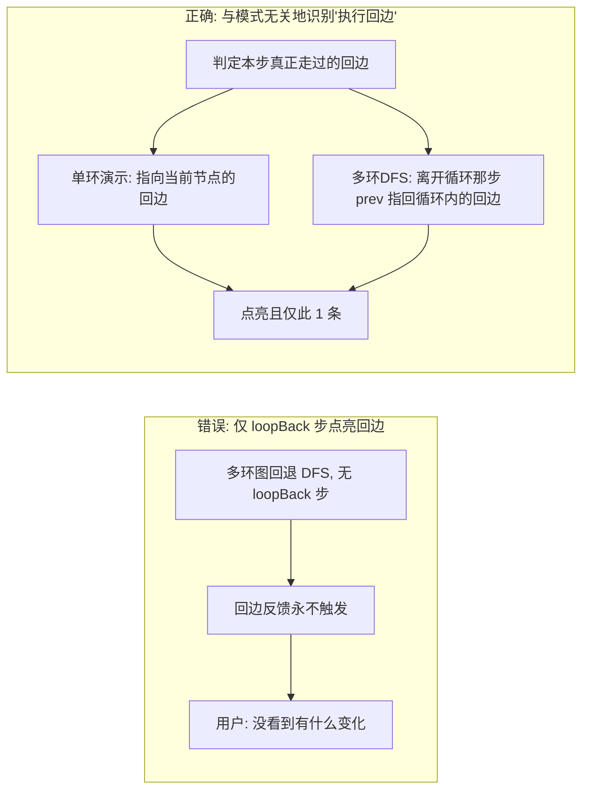
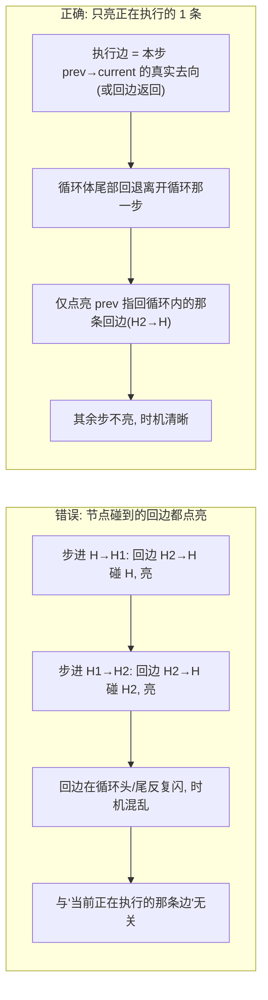

# 回边执行反馈：应绑定「具体执行边」而非「节点」 踩坑记录

本文记录 `mermaid-step-player` 给「回边（循环边）」加执行反馈时，从「完全没反应」到「时机混乱」，再到「精确、短暂」的三次迭代，以及最终采用的判定方案。所有图示均为 Mermaid，可直接在本播放器中渲染。

---

## 背景：希望回边像普通边一样「执行时变色」

普通分支边在被「走过」时会变成绿色 + 流动虚线（`.branch-edge` + `.edge-flow`），反馈明确。回边默认只是静态橙色虚线（`.cycle-edge`）。需求：回边在被走过时，也应点亮（更亮更粗的橙 + 流动），增强「循环返回」的反馈。

## 坑一：绑定 `loopBack` 标志 → 多环图毫无反应

第一版把回边反馈绑定在 `s.loopBack` 标志上（仅单环演示的「回边返回」步为 true）。但多环图会回退到 DFS 顺序、**根本没有 `loopBack` 步**，于是用户实际在测的多环图（如含 `H/R/W` 三个循环的图）完全看不到任何变化。



## 坑二：绑定「节点碰到的回边」 → 时机混乱

第二版改成「播放头停在回边任一端（两端已揭示）就点亮该回边」。多环图终于有反应了，但**循环头/尾每步都亮**——因为任何与当前节点有关的回边都被点亮，完全没考虑它是否「当前正在执行的那条边」。



> 经验：**视觉反馈绝不能靠「当前节点属于某个集合」这种宽松启发来触发**——它会在同一条分支内部、或环的头尾反复误触发。要绑定「与触发事件同源的具体元素（这里是执行边）」。

## 最终方案：只点亮「这一步真正走过的那条回边」，且短暂

判定「正在执行的回边」`execBack`：

- **单环演示的回边返回步（`loopBack`）**：指向当前节点（回到起点）的那条回边。
- **常规步**：若 `prev→current` 不是真实前向边（即从循环体尾部回退离开循环），则 `prev` 指回循环内的回边即「沿回边返回」所走的边；否则（普通前向边）不点亮回边。

```mermaid
flowchart TD
    EB[判定 execBack] --> LB{本步是 loopBack?}
    LB -->|是| T1[指向当前节点(回到起点)的回边]
    LB -->|否| PREV{prev→current 是真实前向边?}
    PREV -->|是 普通前向边| NONE[不点亮回边]
    PREV -->|否 循环体尾部回退离开循环| T2[prev 指回循环内的回边]
    T1 --> ACT[仅该 1 条回边: cycle-edge-active]
    T2 --> ACT
    ACT --> TO[setTimeout ~2.6s 移除类]
    ACT --> NEXT[点下一步重渲染整图→立即消失]
```

动效是**短暂的**：`setTimeout` 约 2.6s 后移除 `cycle-edge-active`；点「下一步」离开当前节点（整图重渲染）立即消失，不长期常亮。

实测（Playwright，多组图）：每步最多 1 条回边高亮，且仅在「回边返回」那一刻出现——单环示例仅 `Check|Init`；双环 `H2|H`、`R2|R`；三环 `H2|H`、`R2|R`、`W2|W`。停留 3s 后自动归零，点下一步立即消失。

---

## 经验

- **反馈要绑定「具体执行的元素/边」，不能用「与当前节点相关的全部同类元素」做触发**。按节点集合触发会在环头/尾、并行分支等处反复误亮，时机混乱。判定必须与「触发事件」同源（这里：执行边 = 本步 `prev→current` 的真实去向 / 回边返回）。
- **「回边不在连续两步间被正向遍历」的结构（多环 DFS 回退）里，要把「从循环体尾部回退离开循环」这一步识别为「沿回边返回」**：此时 `prev→current` 不是真实前向边，`prev` 指回循环内的那条回边即视为被走过的回边。
- **动画/高亮应是短暂的**：用 `setTimeout` 几秒后自动消失，并在「离开当前节点」（下一步重渲染整图）时立即消失，避免长期常亮造成视觉噪音。
- **先验证、再下结论**：反馈「看不见 / 时机乱」往往不是「没写」，而是触发条件绑错了对象（标志不存在 / 绑在节点而非边）。用浏览器逐步实测「每步高亮的边与时机」，比凭空推断可靠。

## 小结（落地 Checklist）

- [x] 回边反馈只绑定 `execBack`（本步真正走过的那条回边），不再按「节点碰到的回边」全部点亮。
- [x] `loopBack` 步：高亮「指向当前节点（回到起点）」的回边；多环 DFS：在「离开循环」那一步高亮 `prev` 指回循环内的回边。
- [x] 每步最多 1 条回边高亮，仅在回边返回那一刻出现，时机清晰不混乱。
- [x] 动效 `cycle-edge-active` 仅持续约 2.6s（`setTimeout` 自动移除），点下一步重渲染整图即立即消失。
- [x] 浏览器逐步实测验证：高亮边与时机符合预期，停留 3s 归零、离开即消失。
