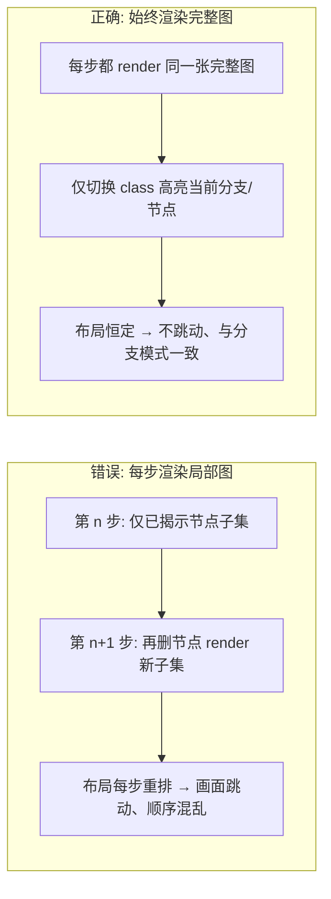
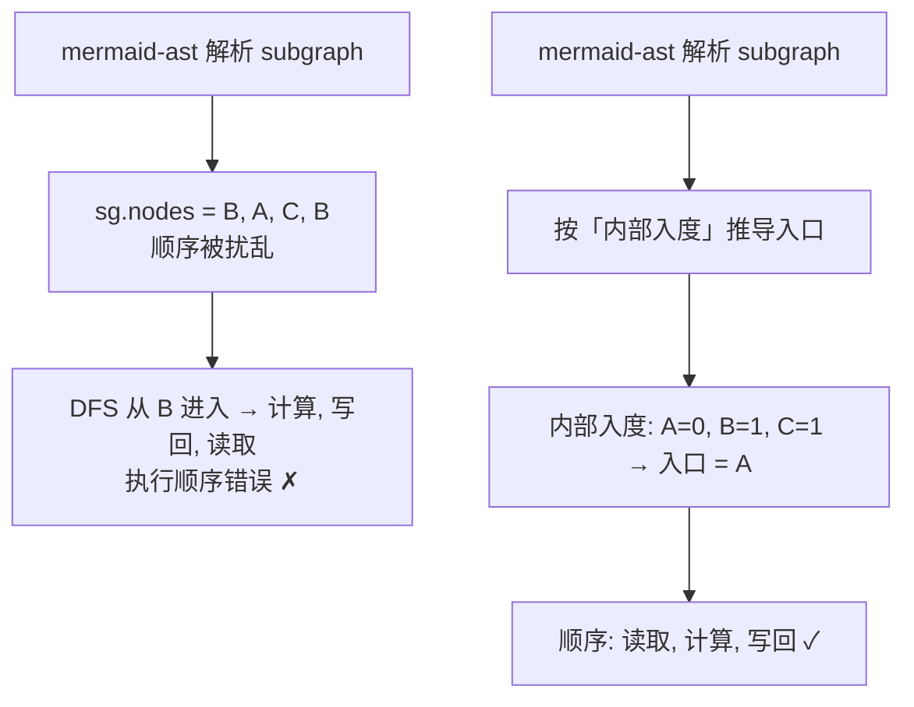
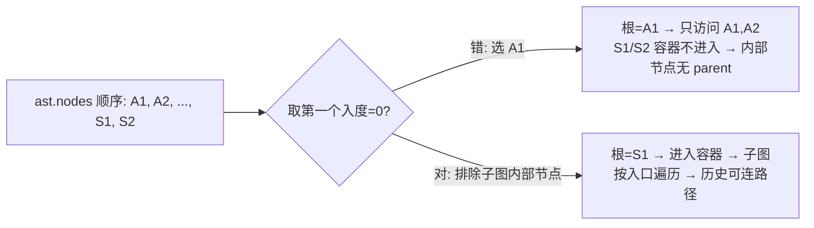
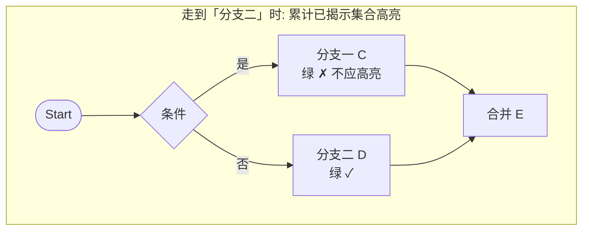
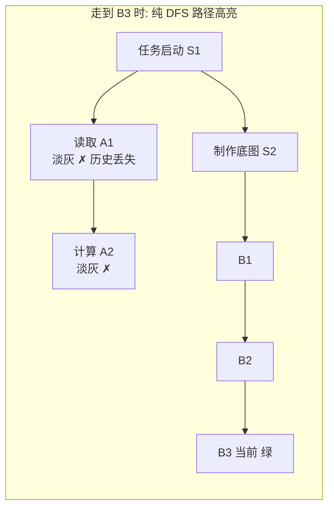
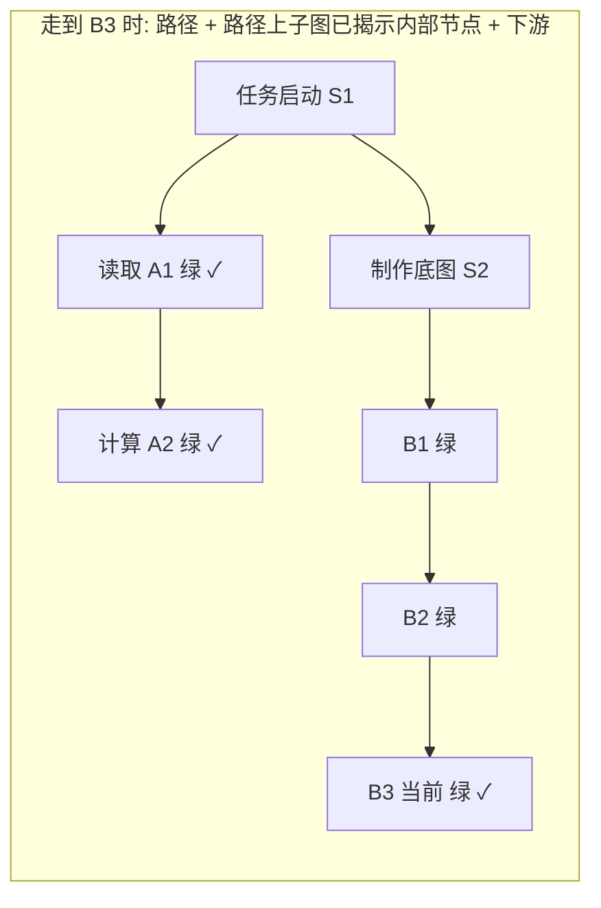

# 子图顺序与分支高亮：实战踩坑记录

本文记录 `mermaid-step-player` 在「全部（深度优先）」逐步播放中，围绕**子图（subgraph）执行顺序**与**分支高亮集合**踩到的四个坑，以及最终采用的修正方案。所有图示均为 Mermaid，可直接在本播放器中渲染。

---

## 坑一：全图逐步播放用「删节点」导致布局每步重排跳动

最初「全部（深度优先）」模式，每一步都**删除尚未揭示的节点**重新生成一份局部 Mermaid 源码再渲染。由于剩余节点集合每步都变，Mermaid 每次都会重新布局，画面剧烈跳动，且与「全图预览 / 独立分支」两模式的布局都不一致。



**修正**：`buildSteps` 不再删节点，每一步的 `mmd` 都存为 `FULL_MMD`（完整图），高亮完全交给 class（`branchNode` / `dimNode` / `curNode`）。这与「独立分支」模式本就一致——分支模式一直就是「整张完整图 + 高亮」。

---

## 坑二：子图内部执行顺序被解析器打乱

`dfsOrder` 进入子图时，直接遍历解析器给的 `sg.nodes` 顺序来选入口节点。但 `mermaid-ast` 给的 `sg.nodes` 顺序并**不可靠**（实测为 `["B","A","C","B"]`，即被打乱），于是 DFS 从 `B` 进入，顺序变成「计算 → 写回 → 读取」。



**修正**：子图入口节点 = 子图内部**入度为 0** 的节点（拓扑序起点），按声明顺序排序；若子图全是环（无入度 0 节点）则回退为声明顺序。不再信任 `sg.nodes` 原始顺序。

---

## 坑三：选根节点误把「子图内部节点」当根

解析器会把子图**内部节点排在容器之前**写入 `ast.nodes`（如 `[A1,A2,...,S1,S2]`）。原 `root` 取「第一个入度为 0 的节点」，于是选中 `A1`（子图内部节点）而非容器 `S1`。后果：`S1`/`S2` 容器从未被 DFS 进入，其内部节点 `A1,A2` 的 `parent` 永远为空，历史节点既无法连成路径、也无法保持高亮。



**修正**：选根时跳过「属于任一子图内部」的节点，优先选非内部、入度为 0 的节点；仍找不到再回退到任意入度 0 节点，最后回退到首个节点。

---

## 坑四：分支高亮集合的三种定义（核心）

「当前分支」到底该高亮哪些节点，是本次最难的一点。试过三种定义：

### 4.1 错误 A：累计已揭示集合（全绿）

把「到当前步为止揭示过的所有节点」都当高亮集合。线性主线上没问题，但**一遇到并行分支**，两条分支会同时变绿——并没有「按分支高亮」。



### 4.2 错误 B：纯 DFS 路径（历史丢失）

只高亮「当前节点 → 根」的树路径。问题是子图容器 `S1` 是 `A1/A2` 的父，但 `A1/A2` 不是 `B3` 的祖先——从 `B3` 向上走 `B3→B2→B1→S2→S1` 就**停在了容器 `S1`**，不会再下钻到 `A1,A2`。于是跳到第二个子图时，第一个子图的历史节点丢失高亮。



### 4.3 正确：路径 + 路径上子图已揭示内部节点 + 下游合并

高亮集合 = `当前节点→根` 的树路径，**并上**「路径上每个子图容器的已揭示内部节点」（上游子图历史保持），**再并上**「从当前节点沿已揭示边向下游延伸的节点」（合并点之后）。



> 说明：`A1,A2` 因容器 `S1` 在路径上且已揭示而保持高亮；`B4,B5` 尚未揭示仍为淡灰（增量揭示保留）。切到另一分支时，非当前分支节点（含其所在子图）恢复淡灰——「只高亮当前分支」。

**最终公式**：

```
branchNodes = 树路径(当前节点 → 根)
            ∪ { 路径上每个子图容器 c 的 已揭示内部节点 }
            ∪ { 下游延伸: 从当前节点沿「已揭示」边可达的节点(合并点之后) }

branchEdges = { 两端都在 branchNodes 中的边 }
```

> 「路径上子图容器」采用「已揭示内部节点」而非「全部内部节点」：既保留上游子图历史，又不强制点亮当前子图中尚未走到的节点，增量揭示体验不变；同时当前子图即便未走完，也被整体视作「当前分支」（用户确认可接受）。

---

## 小结（落地 Checklist）

- [x] 「全部（深度优先）」与「独立分支」统一为**完整图 + class 高亮**，布局不再跳动。
- [x] 子图入口按**内部入度 0** 推导（拓扑序），不依赖解析器 `sg.nodes` 顺序。
- [x] 选根跳过**子图内部节点**，保证容器被进入、`parent` 链完整。
- [x] 分支高亮 = **路径 + 路径上子图已揭示内部节点 + 下游合并**；切换分支时非当前分支节点恢复淡灰。
- [x] 独立分支模式（`buildBranch`）保持原「单路径高亮」语义，不受影响。
