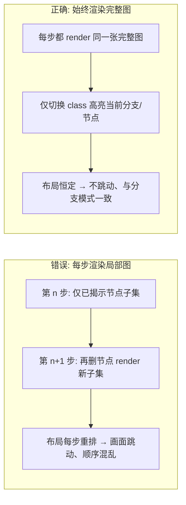
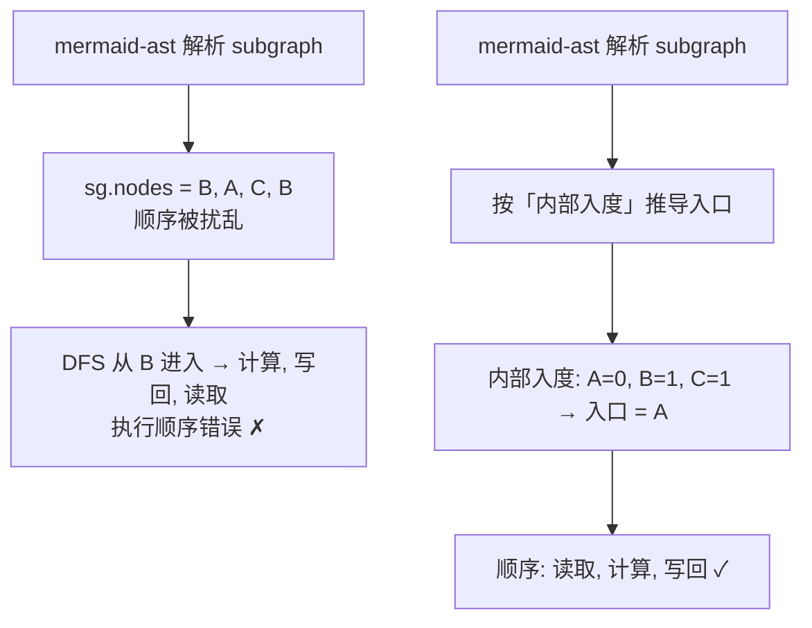
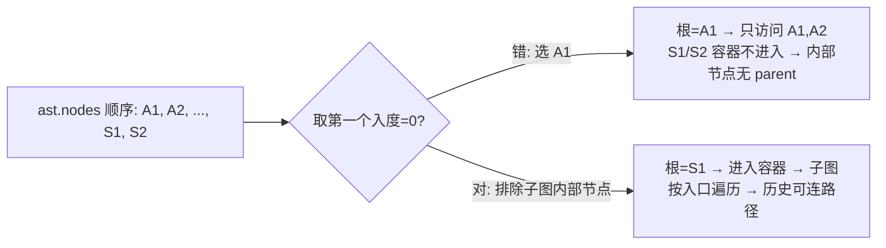
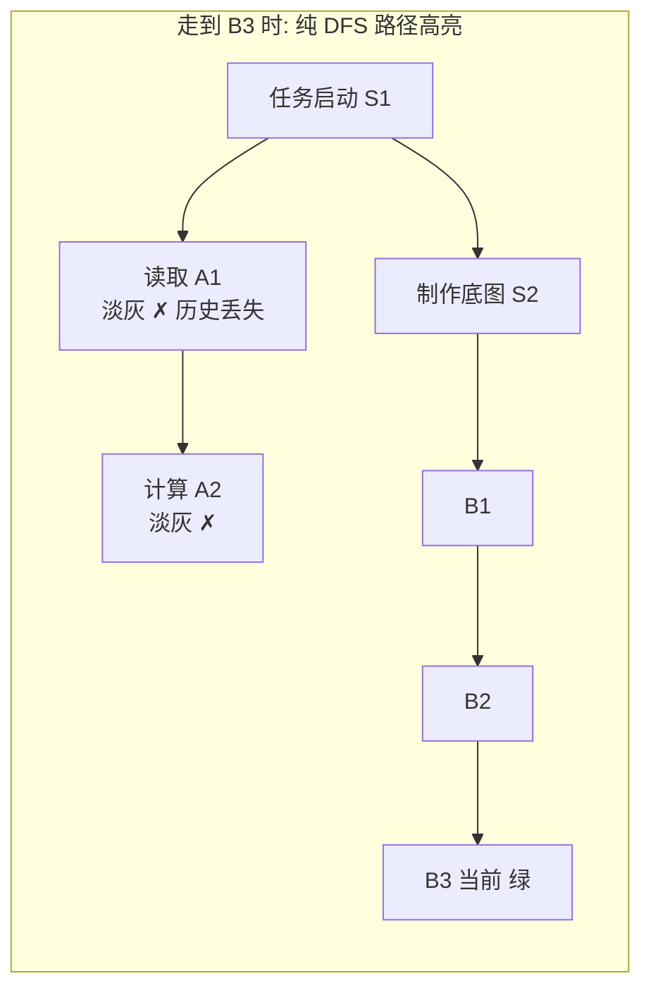
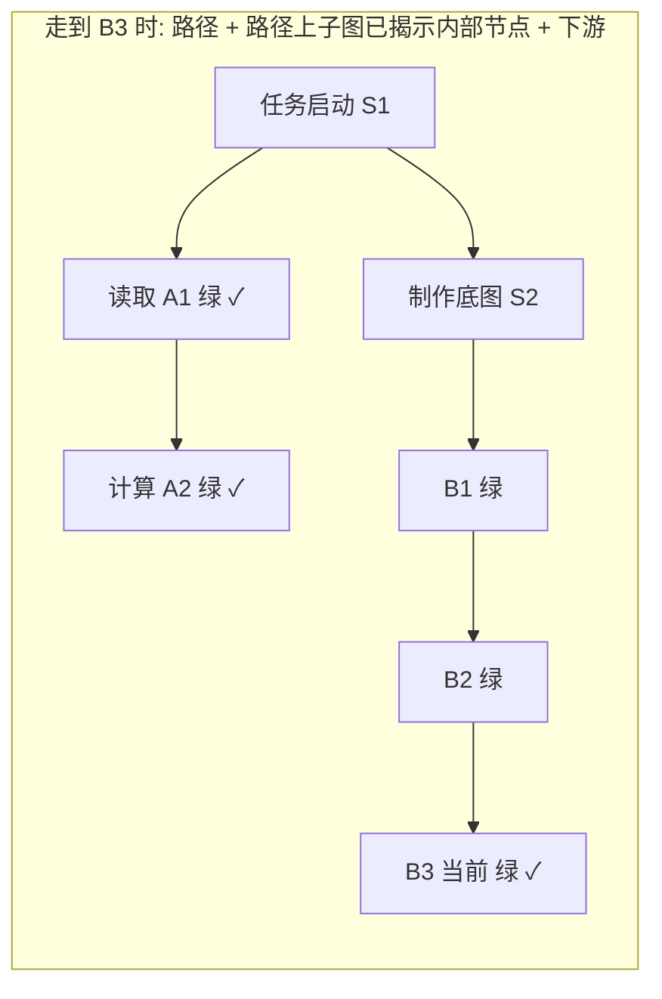
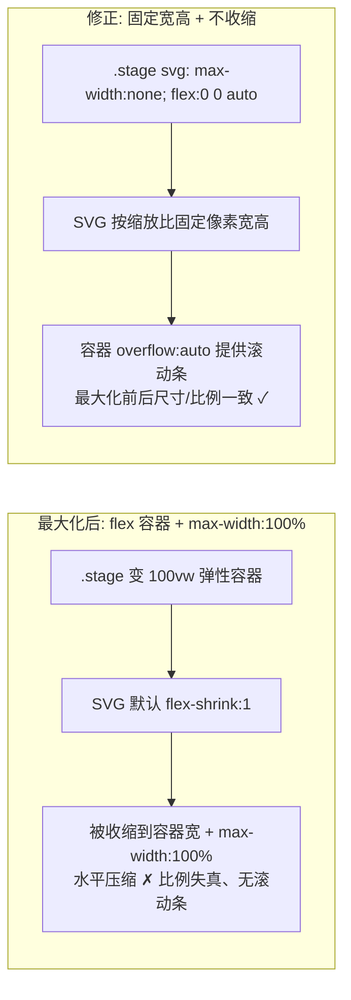
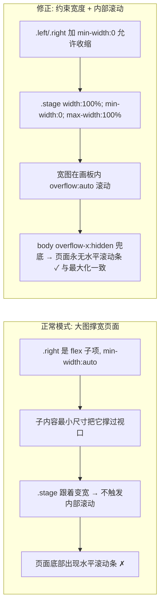

# 子图顺序与分支高亮：实战踩坑记录

本文记录 `mermaid-step-player` 在「全部（深度优先）」逐步播放中，围绕**子图（subgraph）执行顺序**与**分支高亮集合**踩到的四个坑，以及最终采用的修正方案。所有图示均为 Mermaid，可直接在本播放器中渲染。

---

## 坑一：全图逐步播放用「删节点」导致布局每步重排跳动

最初「全部（深度优先）」模式，每一步都**删除尚未揭示的节点**重新生成一份局部 Mermaid 源码再渲染。由于剩余节点集合每步都变，Mermaid 每次都会重新布局，画面剧烈跳动，且与「全图预览 / 独立分支」两模式的布局都不一致。



**修正**：`buildSteps` 不再删节点，每一步的 `mmd` 都存为 `FULL_MMD`（完整图），高亮完全交给 class（`branchNode` / `dimNode` / `curNode`）。这与「独立分支」模式本就一致——分支模式一直就是「整张完整图 + 高亮」。

---

## 坑二：子图内部执行顺序被解析器打乱

`dfsOrder` 进入子图时，直接遍历解析器给的 `sg.nodes` 顺序来选入口节点。但 `mermaid-ast` 给的 `sg.nodes` 顺序并**不可靠**（实测为 `["B","A","C","B"]`，即被打乱），于是 DFS 从 `B` 进入，顺序变成「计算 → 写回 → 读取」。



**修正**：子图入口节点 = 子图内部**入度为 0** 的节点（拓扑序起点），按声明顺序排序；若子图全是环（无入度 0 节点）则回退为声明顺序。不再信任 `sg.nodes` 原始顺序。

---

## 坑三：选根节点误把「子图内部节点」当根

解析器会把子图**内部节点排在容器之前**写入 `ast.nodes`（如 `[A1,A2,...,S1,S2]`）。原 `root` 取「第一个入度为 0 的节点」，于是选中 `A1`（子图内部节点）而非容器 `S1`。后果：`S1`/`S2` 容器从未被 DFS 进入，其内部节点 `A1,A2` 的 `parent` 永远为空，历史节点既无法连成路径、也无法保持高亮。



**修正**：选根时跳过「属于任一子图内部」的节点，优先选非内部、入度为 0 的节点；仍找不到再回退到任意入度 0 节点，最后回退到首个节点。

---

## 坑四：分支高亮集合的三种定义（核心）

「当前分支」到底该高亮哪些节点，是本次最难的一点。试过三种定义：

### 4.1 错误 A：累计已揭示集合（全绿）

把「到当前步为止揭示过的所有节点」都当高亮集合。线性主线上没问题，但**一遇到并行分支**，两条分支会同时变绿——并没有「按分支高亮」。


### 4.2 错误 B：纯 DFS 路径（历史丢失）

只高亮「当前节点 → 根」的树路径。问题是子图容器 `S1` 是 `A1/A2` 的父，但 `A1/A2` 不是 `B3` 的祖先——从 `B3` 向上走 `B3→B2→B1→S2→S1` 就**停在了容器 `S1`**，不会再下钻到 `A1,A2`。于是跳到第二个子图时，第一个子图的历史节点丢失高亮。



### 4.3 正确：路径 + 路径上子图已揭示内部节点 + 下游合并

高亮集合 = `当前节点→根` 的树路径，**并上**「路径上每个子图容器的已揭示内部节点」（上游子图历史保持），**再并上**「从当前节点沿已揭示边向下游延伸的节点」（合并点之后）。



> 说明：`A1,A2` 因容器 `S1` 在路径上且已揭示而保持高亮；`B4,B5` 尚未揭示仍为淡灰（增量揭示保留）。切到另一分支时，非当前分支节点（含其所在子图）恢复淡灰——「只高亮当前分支」。

**最终公式**：

```
branchNodes = 树路径(当前节点 → 根)
            ∪ { 路径上每个子图容器 c 的 已揭示内部节点 }
            ∪ { 下游延伸: 从当前节点沿「已揭示」边可达的节点(合并点之后) }

branchEdges = { 两端都在 branchNodes 中的边 }
```

> 「路径上子图容器」采用「已揭示内部节点」而非「全部内部节点」：既保留上游子图历史，又不强制点亮当前子图中尚未走到的节点，增量揭示体验不变；同时当前子图即便未走完，也被整体视作「当前分支」（用户确认可接受）。

---

## 坑五：最大化后画布里的图被水平压缩、比例失真

点「⛶ 最大化」后，`.stage` 变成 `position:fixed; inset:0; width:100vw; height:100vh` 的弹性容器（`display:flex`）。而 SVG 是按缩放比 `baseW*zoom` 设了固定像素宽高（`applyZoomTo`），本应等比例显示。

但原 CSS 里 `.stage svg { max-width:100% }` 且 SVG 是 flex 子项、默认 `flex-shrink:1`。最大化后容器变宽，SVG 在弹性布局里被**收缩到容器宽度**（同时 `max-width:100%` 进一步压窄），于是水平方向被压缩、比例失真、不出现水平滚动条——而最大化前的窄画布里 SVG 因 `overflow:auto` 溢出反而有滚动条。两个状态下尺寸/比例不一致。



**修正**：
- `.stage svg` 改为 `max-width:none; height:auto; flex:0 0 auto;`——`flex:0 0 auto` 让 SVG 在弹性容器里永不收缩，始终按设定的缩放比固定宽高；居中改用容器 `align-items/justify-content: safe center`（见坑六），`overflow:auto` 负责在超出时出现滚动条。
- `.stage.max svg` 的 `max-width:100%` 一并改为 `none`，消除最大化场景下的额外压窄。
- `setMax` 切换最大化后调用 `applyZoomTo(st)`，按当前缩放比重新设定 SVG 尺寸，确保最大化前后完全一致。

> 经验：**SVG 放进 `display:flex` 的画布时，务必给 SVG 设 `flex:0 0 auto` + `max-width:none`**，否则任一更宽的容器状态（最大化、分屏、缩放）都会把它压扁。缩放只用「显式像素宽高 = 基准尺寸 × 缩放比」一种手段，不要依赖 `max-width:100%`。

---

## 坑六：最大化后画布顶部被固定控制栏遮挡（正常模式不遮挡）

现象：点「⛶ 最大化」后画布**顶部被上方按钮栏盖住**，但最大化前（正常模式）完全正常。遮挡只在 max 态出现，说明根因与「固定控制栏 + 全屏 stage」的组合有关。

### 6.1 关键根因：按 id 取控制栏却拿不到元素，偏移从未生效

`fitMaxTop()` 想按控制栏高度把 stage 往下挪（`top = 控制栏高`），但它用 `$('controls')` 取元素。而 `$` 是 `getElementById`，控制栏实际是 `<div class="controls">`——**只有 class、没有 id**。于是 `getElementById('controls')` 返回 `null`，`null.offsetHeight` 直接抛 `TypeError`，后续的 `st.style.top` 根本没执行。

```mermaid
flowchart LR
    subgraph BAD[最大化后: top 偏移未生效]
        B1[fitMaxTop 调 $('controls')] --> B2[控制栏只有 class 无 id → 返回 null]
        B2 --> B3[null.offsetHeight 抛错 → st.style.top 未设置]
        B3 --> B4[stage 仍 top:0 + inset:0 铺满视口<br/>固定控制栏 z-index 更高 → 盖住画布顶部 ✗]
    end
    subgraph OK[修正: 按 class 取元素]
        O1[document.querySelector('.controls').offsetHeight] --> O2[top = ch; height = calc(100vh - ch)]
        O2 --> O3[画布刚好填满控制栏下方 ✓ 与正常模式一致]
    end
```

**修正**：用 `document.querySelector('.controls')` 取控制栏（并用 `|| {}` 兜底防抛错）；按其实测高度设 `top` 与 `height: calc(100vh - ch)`，使画布刚好填满控制栏以下的视口；退出最大化时复位这些内联样式。

### 6.2 连带根因：flex `margin:auto` 垂直居中把超高 SVG 的顶部裁掉

即便 `top` 偏移正确，`.stage` 用 `display:flex` + SVG `margin:auto` 垂直居中时，若 SVG 比画布高，flex 会把 SVG 顶部推到容器内容区**之上**并裁切，且 `overflow:auto` 下**滚不上去**——同样表现为"顶部被遮"。

**修正**：去掉 SVG 的 `margin:auto`，容器改 `align-items: safe center; justify-content: safe center;`。`safe` 关键字让图能容纳时居中、容纳不下时**回退到顶端对齐且可滚动**，顶部不再被裁切、最大化前后表现一致（旧浏览器不支持 `safe` 也会回退成顶端/左对齐，同样不遮挡）。

> 经验：**用 JS 按元素高度做布局偏移时，先确认选择器真能取到元素**——`getElementById` 只认 `id`，class 要用 `querySelector`，否则拿到 `null` 直接抛错、整段逻辑静默失效。全屏固定层（`position:fixed; inset:0`）叠在固定工具条上时，必须手动把下层 `top` 让出工具条高度，并同步把 `height` 收成 `calc(100vh - 工具条高)`，否则底部会溢出屏外。

---

## 交互增强：底部节点链表 / 画布平移 / 工具切换

「逐步揭示」之外，又补了三种画布交互，统一围绕"先看全局、再精确定位"：

- **底部节点链表**（`.chain`）：画布下方用 `>` 串联展示节点。全部模式 = 深度优先顺序的全部节点（含子图容器，显示其标题如「核心处理」）；分支模式 = 该分支单条路径。超长名称 CSS 省略号截断（`title` 看全名）。点击任一节点 → 跳到该步并激活（成为当前节点、脉冲高亮、自动滚动到可视区），底部列表同步高亮当前节点。
- **画布平移**：`.stage` 复用 `overflow:auto` 滚动机制，左键按住拖动画板即平移视口（`scrollLeft/Top` 随拖拽增量变化），缩放比/布局不受影响；光标 `grab`↔`grabbing`，仅左键、右键忽略。
- **工具切换**：控制栏「✋ 拖动视图 / ⚲ 选择节点」切换。`panMode=true` 时左键拖拽平移；`false`（选择工具）时可点选节点内文字（不再平移）。任意工具下**双击**画布节点即跳到该节点并激活——`dblclick` 监听不判断 `panMode`，平移态下双击也能激活。

### 坑七：双击画布节点高亮了，但底部节点链表不跟随

现象：双击（选择 / 拖动工具下均可）画布节点，画布上该节点高亮了，但底部节点链表中高亮的仍是上一步的节点——列表没跟着更新。注意：选择工具下**单击**只用于点选节点内文字、不激活；节点激活统一走**双击**。

根因：底部列表的当前高亮由 `updateChainActive()` 依据**模块级变量 `step`** 决定（它读 `STEPS[step].currentId`）。而画布节点的点击/双击处理只调用了 `show(idx)`，却**没有把 `idx` 赋给 `step`**。于是 `show` 渲染的是第 `idx` 步（画布正确高亮），`updateChainActive` 仍按旧的 `step` 高亮——两者脱节。

```mermaid
flowchart LR
    subgraph BAD[点击节点 X]
        B1[handler 调 show(idx)] --> B2[画布渲染第 idx 步: X 高亮 ✓]
        B2 --> B3[updateChainActive 读旧 step → 高亮旧节点 ✗]
    end
    subgraph OK[修正]
        O1[handler 先 step = idx] --> O2[再 show(idx)]
        O2 --> O3[updateChainActive 读新 step → X 高亮 ✓ 列表同步]
    end
```

**修正**：在节点点击/双击处理里，激活前先 `step = idx;` 再 `show(idx);`（与底部链表的自身点击逻辑保持一致）。这样画布高亮与底部链表高亮始终指向同一步。

> 经验：凡有"激活某节点/某步"的入口（底部链表点击、画布点击、画布双击），都要**统一先写 `step` 再 `show`**，否则会出现"画面高亮对了、列表没跟上"的不一致。

---

## 坑八：正常模式大图撑宽页面、底部出现水平滚动条（与最大化不一致）

现象：非最大化（原始页面）下，mermaid 图很宽、向右扩展时，画板视口被一起撑宽，页面底部出现**水平滚动条**；而最大化态画板 `position:fixed` 贴住视口、宽图在画板内滚动、页面没有水平滚动条。用户希望两种状态一致：画板最大宽度 = 页面宽度，不再有页面级水平滚动条。

根因：`.right` 是 `.wrap`（`display:flex`）的 flex 子项，默认 `min-width:auto`——子内容的最小尺寸会把它撑到超过视口宽度。`.stage` 虽设了 `overflow:auto`，但父级 `.right` 宽度没被约束，于是 `.stage` 也跟着变宽、自身不再触发内部滚动，最终页面被撑出水平滚动条。



**修正**：
- `.left` / `.right` 加 `min-width:0`，允许 flex 子项收缩到小于内容最小尺寸（不再被撑过视口）。
- `.stage` 加 `width:100%; min-width:0; max-width:100%`——宽度永远不超容器，宽图在画板内部 `overflow:auto` 滚动，而非撑宽页面。
- `body` 加 `overflow-x:hidden` 作为兜底，保证页面级水平滚动条永不出（画板内仍正常滚动）。

> 经验：**flex 子项默认 `min-width:auto` 会被内容撑大**——只要里面有可能很宽的内容（大图、长表格、不换行的工具栏），就给它 `min-width:0`。需要"内部滚动而非撑宽外层"的容器，宽度务必 `max-width:100%` + `min-width:0`，再配合 `overflow:auto`。

---

## 小结（落地 Checklist）

- [x] 「全部（深度优先）」与「独立分支」统一为**完整图 + class 高亮**，布局不再跳动。
- [x] 子图入口按**内部入度 0** 推导（拓扑序），不依赖解析器 `sg.nodes` 顺序。
- [x] 选根跳过**子图内部节点**，保证容器被进入、`parent` 链完整。
- [x] 分支高亮 = **路径 + 路径上子图已揭示内部节点 + 下游合并**；切换分支时非当前分支节点恢复淡灰。
- [x] 独立分支模式（`buildBranch`）保持原「单路径高亮」语义，不受影响。
- [x] SVG 放进 `display:flex` 画布须设 `flex:0 0 auto` + `max-width:none`，最大化/分屏/缩放都不会被压扁，比例始终一致。
- [x] 最大化偏移必须按**真实元素**取高度：控制栏用 `querySelector('.controls')`（非 `getElementById`），并同步设 `top` 与 `height: calc(100vh - 控制栏高)`，避免被固定控制栏遮挡、底部溢出屏外。
- [x] 画布垂直居中用容器 `safe center` 取代 SVG `margin:auto`，超高图回退顶端对齐、可滚动，最大化前后表现一致。
- [x] 底部节点链表（全部/分支路径，`>` 连接，省略号截断，点击跳转并同步高亮当前节点）。
- [x] 画布左键拖拽平移视口（复用 `overflow` 滚动，仅左键、光标 `grab`/`grabbing`）。
- [x] 工具切换「拖动 / 选择」：选择工具下可点选节点内文字（不激活）；任意工具双击画布节点即激活（底部链表同步高亮）。
- [x] 激活节点的所有入口统一先写 `step` 再 `show`，保证画布高亮与底部链表高亮一致（坑七）。
- [x] 正常模式画板宽度受容器约束（`min-width:0` + `max-width:100%`），宽图在画板内滚动；`body` 加 `overflow-x:hidden` 兜底，页面永无水平滚动条，与最大化态一致（坑八）。
