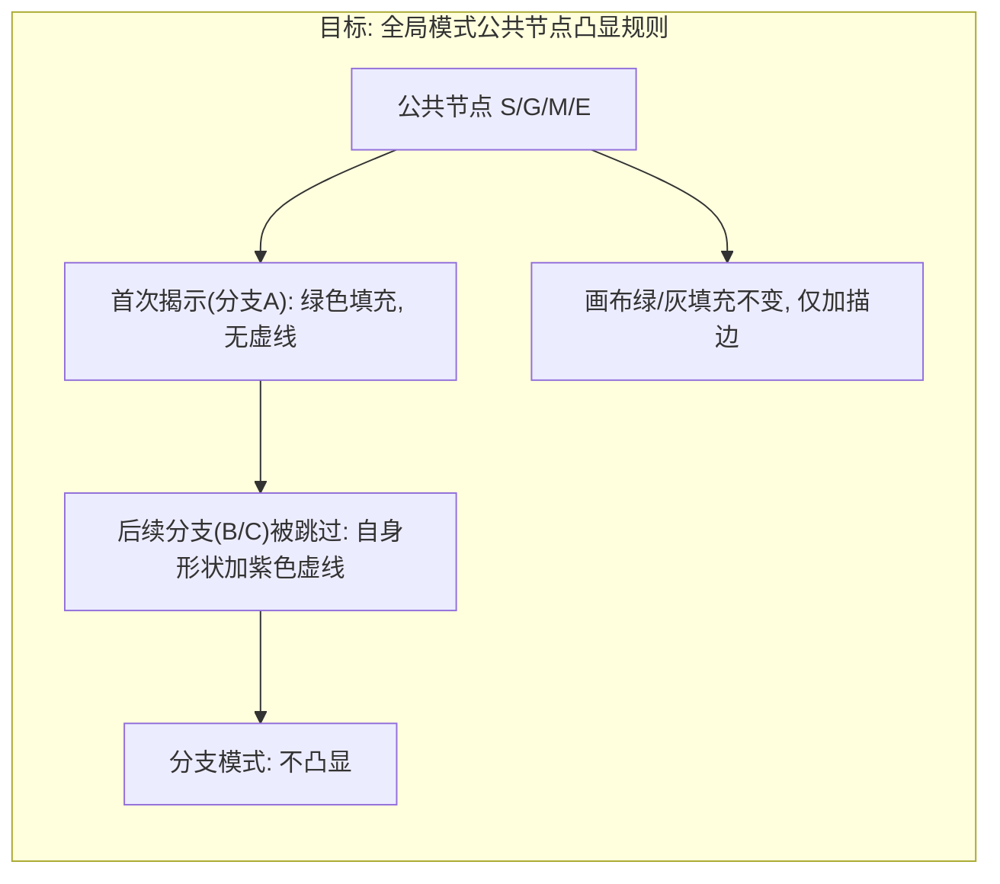
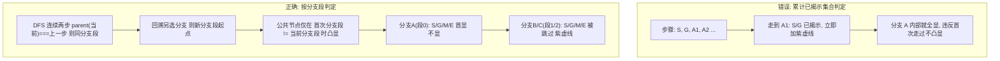
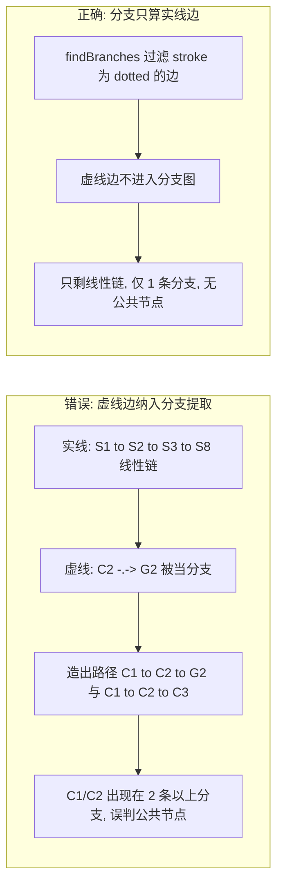
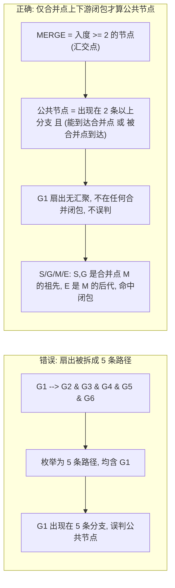
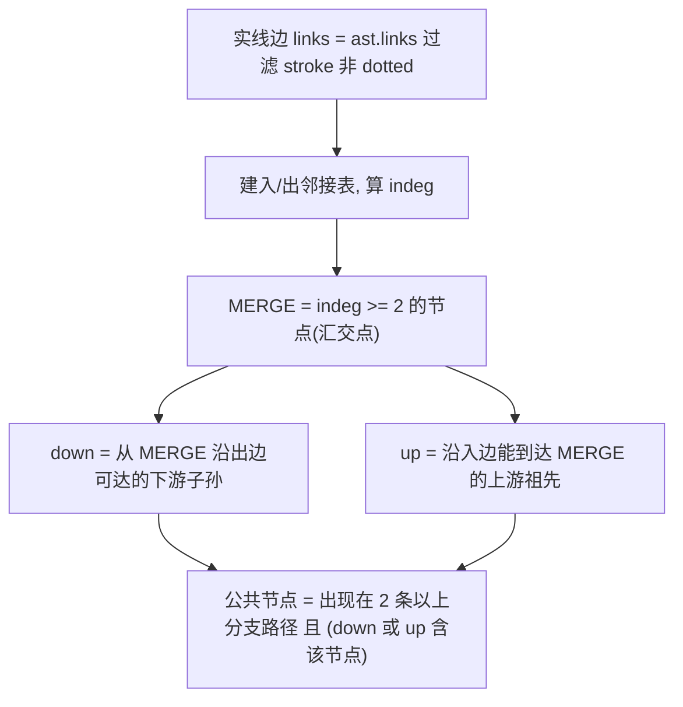
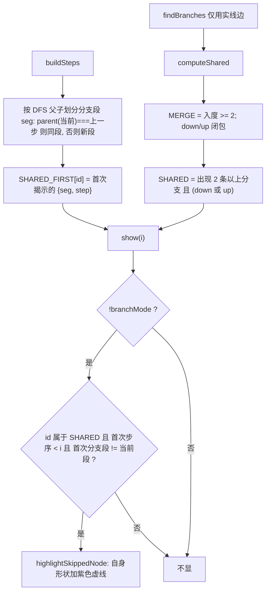

# 被跳过的公共节点：紫色虚线凸显 踩坑记录

本文记录 `mermaid-step-player` 在「全部（深度优先）」模式下，为**被跳过的公共节点**加「紫色虚线描边」凸显时踩到的两个坑，以及最终采用的修正方案。所有图示均为 Mermaid，可直接在本播放器中渲染。

---

## 背景与目标

「全局（深度优先）」逐步播放时，DFS 会先走完一条分支（如示例二的分支 A：`S→G→A1→A2→M→E`），再回溯走分支 B（`…→B1→B2→M→E`）、分支 C。其中 `S/G/M/E` 是**公共节点**（被多条分支共用）：它们在分支 A 里首次被揭示，到分支 B/C 时已被揭示过、本次被「跳过」执行。

需求（用户对凸显时机的两条硬性要求）：

1. **首次走过不凸显**：公共节点第一次被揭示时不加虚线，只有后续分支「跳过」它时才凸显。
2. **时机与绿色填充一致**：不是一上来就全凸显，而是「已经被跳过的才凸显，还没走到那里先不凸显」。

---

## 坑一：凸显时机错误（首走就显 / 一上来全显）

最初用「累计已揭示集合」判断：每一步把**所有已揭示过的公共节点**都加虚线。问题在于「已揭示」包含「同一条分支里更早的节点」——于是分支 A 里走到 `A1/A2` 时，`S/G` 已被揭示，立刻被虚线凸显，违反「首次走过不凸显」。

**修正逻辑**：

- `buildSteps` 中按 DFS 父子关系划分「分支段」：`parent(当前) === 上一步` 说明是向下延伸（同一分支），否则是回溯后另选分支（新分支段起点）。每个 step 记录 `seg`。
- 记录每个公共节点「首次被揭示」所在的分支段 `SHARED_FIRST[id] = { seg, step }`。
- `show(i)` 中仅当 `!branchMode` 且公共节点满足 `首次步序 < 当前步 且 首次分支段 !== 当前分支段` 时，才 `highlightSkippedNode`。

> 经验：**「动态出现」的视觉标记，绝不能靠「累计集合」驱动**——累计集合会在同一条分支内部就把更早的节点误触发。要用「与触发事件同源的判定」（这里是「分支段切换」），才能保证标记随播放进度自然出现/消失。

---

## 坑二：公共节点判定错误（误把普通节点当公共节点）

「公共节点」本应只含真正被多条分支共用的节点（`S/G/M/E` 这类汇交点及其上下游）。但用 `findBranches` 的「极大简单路径计数」直接判定，会引入两类假阳性，把普通节点（`C1/C2/G1`）误判为公共节点而错误加虚线。

### 2.1 假阳性 A：虚线注释边（`-.->`）被当成分支

业务图里常用**虚线边**画注释 / 次要流向（如 `C2 -.-> G2`、`F1 -.-> G1`、`D1 -.-> E1`）。它们在 `mermaid-ast` 里 `stroke:"dotted"`。若分支提取把它们当普通边，`C2→G2` 会被当作一条独立分支路径，于是 `C1`、`C2` 出现在多条「分支」中 → 被误判为公共节点。

### 2.2 假阳性 B：纯扇出被拆成多条路径（`G1` 误判）

`G1 --> G2 & G3 & G4 & G5 & G6` 是**一个扇出点**的并行输出。`findBranches` 会把它枚举成 5 条路径 `[G1,G2]…[G1,G6]`，于是 `G1` 出现在 5 条「分支」里 → 被误判为公共节点。但 `G1` 在全局 DFS 里只被揭示一次、从不「被跳过」，本不该凸显。

**修正逻辑**（`computeShared`）：

- 分支提取（`findBranches`）只使用**实线边**（过滤 `stroke==="dotted"`），虚线注释边不进入分支图。
- `SHARED` = 出现在 ≥2 条分支路径、且处于「合并点（入度≥2）上下游闭包」内的节点：合并点本身 + 其上游祖先（共享前缀，如 `S/G`）+ 下游子孙（共享后缀，如 `E`）。这既保留 `S/G/M/E`，又排除纯扇出（`G1→G2..G6` 无汇聚）与虚线边造成的假分支。

> 经验：**「公共 / 共享」的正确语义是「合并点闭包」，不是「出现在多条路径就行」**。路径枚举会对扇出、虚线边过度拆分，必须回到图结构本身（合并点 = 入度≥2）来界定共享范围。注释/次要流向一律用虚线，并在分支/共享计算里显式排除虚线边。

---

## 最终公式

调用点：`SHARED = computeShared(branches, ast);`（注意传入 `ast` 以拿到实线边与入度）。

---

## 小结（落地 Checklist）

- [x] 凸显时机用**分支段切换**驱动，而非「累计已揭示集合」：首次走过不显，后续分支跳过才显，时机与绿色填充一致。
- [x] `buildSteps` 为每个 step 记录 `seg`（DFS 父子连续 ⇒ 同段，回溯另选 ⇒ 新段）。
- [x] `SHARED_FIRST[id]` 记录公共节点「首次揭示的分支段 + 步序」，`show` 里比对 `首次段 !== 当前段` 才凸显。
- [x] 分支提取 `findBranches` 只算**实线边**，过滤 `stroke==="dotted"` 的虚线注释边，避免造出假分支。
- [x] `computeShared` 以**合并点（入度≥2）上下游闭包**界定公共节点，排除纯扇出（`G1→G2..G6`）过度拆分造成的误判。
- [x] 分支模式不凸显；画布绿/灰填充不变，仅给被跳过节点加紫色虚线描边（inline `!important` 覆盖 `branchNode` 等配色）。
- [x] 底部节点链表始终以紫色描边标出公共节点（与画布凸显独立，纯 UI 提示）。
