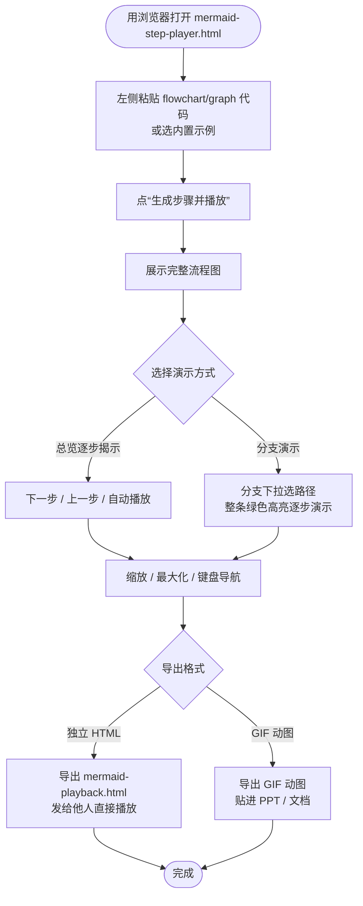

## 软件名称

Mermaid 流程图逐步播放器（MermaidStepPlayer）

## 应用平台

在线服务（单 HTML 文件，任意现代浏览器直接打开；Windows / macOS / Linux 均可运行）

## 推荐类型

【开发者自荐】

## 一句简介

把 Mermaid 流程图按深度优先顺序「逐步播放」出来，并一键导出独立 HTML 或 GIF 动图。

## 应用简介

MermaidStepPlayer 是一个**纯前端、单文件**的流程图演示工具。你只需把任意 `flowchart` / `graph` 代码粘贴进去，它就会解析图结构，按**深度优先**顺序一步步揭示节点与边，像放幻灯片一样把流程"走"给你看——非常适合做技术方案讲解、教学演示、需求评审或分享给他人。

核心特性：

- **逐步揭示**：上一步 / 下一步 / 自动播放，按深度优先顺序逐个高亮节点与路径。
- **分支演示**：自动识别图中所有"源→汇"的简单路径（分支），下拉切换即可整条分支绿色高亮、逐步演示；含 subgraph 子图、classDef / style 均支持。
- **环图不卡死**：遇到回边 / 循环，自动按简单路径拆分并标注为橙色虚线，不会死循环。
- **直观配色**：绿色=当前分支路径，橙色虚线=回边/循环，橙色脉冲=当前节点，淡灰=其它已揭示节点。
- **缩放 / 最大化 / 快捷键**：支持滚轮与滑条缩放、全屏铺满、← → 空格等键盘操作。
- **一键导出**：可导出**独立 HTML 播放文件**（内嵌当前图，发给别人直接播放），也可导出** GIF 动图**（逐步揭示的每一帧编码成动画，直接贴进 PPT / 文档）。
- **零安装**：整个工具就是一个 HTML 文件，双击即可在浏览器中使用（渲染依赖通过 CDN 加载，需联网）。
- **最近浏览历史**：点击“生成步骤并播放”即把当前图记入历史（本地持久化，最多 50 条）；「历史」下拉框以图中第一个节点的真实显示名 + 时间命名，选中或点「浏览」可重新加载播放；「删除当前」删除正在浏览的记录、「清空」清空全部。
- **拷贝节点列表**：画板下方「⧉ 拷贝节点列表」按钮，把当前已运行到的节点（首节点到当前步）以 `>` 连接复制到剪贴板，便于粘贴成路径文本。

适合人群：需要讲解流程图的技术同学、教师、产品经理，以及任何想把 Mermaid 图"动起来"的人。

## 用法

直接用浏览器打开 `mermaid-step-player.html` 即可（需联网加载 CDN 资源）：

1. 左侧粘贴完整 `flowchart` / `graph` 代码，或选内置示例；
2. 点“生成步骤并播放”，先展示完整流程图；
3. 用“下一步/上一步/自动播放”逐步揭示，或在“分支”下拉框选某条分支演示；
4. 非流程图（时序图、类图等）直接显示完整图，不支持逐步揭示；
5. 点“⤓ 导出播放文件”，先在「格式」下拉选 **独立 HTML 播放文件** 或 **GIF 动图**；导出 GIF 时可用「导出缩放」调节输出尺寸（默认 2×），然后导出：HTML 产物为独立的 `mermaid-playback.html`（已内嵌当前图、无左侧输入），GIF 产物为动画 `mermaid-playback.gif`。
6. 「历史」下拉框记录最近浏览的图（点“生成步骤并播放”时自动记录），选中或点「浏览」可重新加载；「删除当前」删除正在浏览的记录、「清空」清空全部历史。

## 使用说明（流程图）

##  导出gif效果

## 官方网站

- Gitee：https://gitee.com/kehehee1/mermaid-step-player
- GitHub：https://github.com/kehehee1/MermaidStepPlayer

## 开源协议

本项目采用 **MIT License**